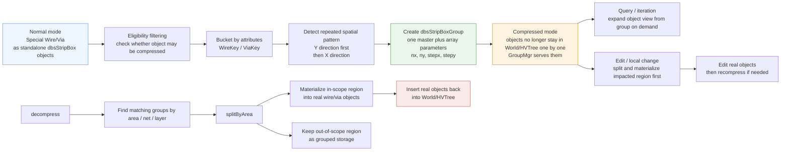
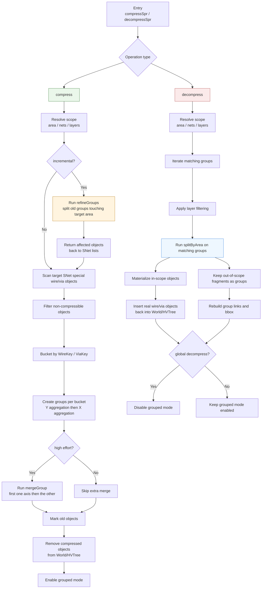
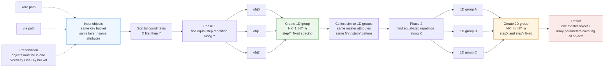
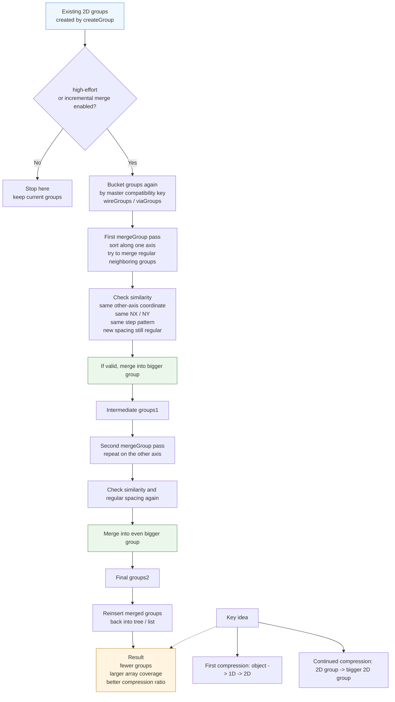
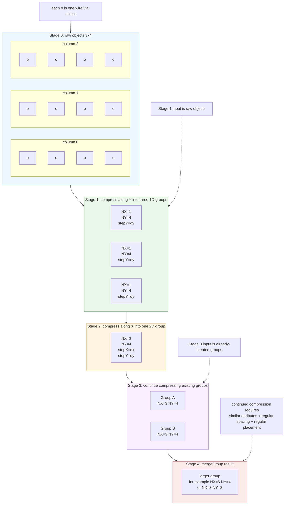

# Compressed PG DB Spec

## 1. Purpose

This document specifies the current design and expected behavior of the compressed PG DB flow implemented around special-route wire/via compression.

The goal of compressed PG DB is to reduce memory footprint and improve query scalability for PG special routing data by replacing large numbers of repeated special wires and vias with grouped array-like representations.

This document is based on the current implementation in the following files:

- `db/physical/dbTopCellSprData.c`
- `db/physical/dbStripBoxGroup.c`
- `db/physical/dbStripBoxGroup.h`

## 2. Scope

The compressed PG DB flow applies to:

- special-route wires
- special-route vias
- PG-related routing data stored in top-cell physical databases

The flow does not target signal-route wires/vias.

## 3. High-Level Model

### 3.1 Normal mode

In normal mode, special-route wires and vias exist as individual `dbsStripBox` objects:

- attached to `dbsSNet`
- inserted into top-cell world/HV trees
- returned directly by standard world iteration and query paths

### 3.2 Compressed mode

In compressed mode, qualifying special-route objects are replaced by `dbsStripBoxGroup` objects managed by `dbsNetStripBoxGroup` and `dbsStripBoxGroupMgr`.

Each group represents a repeated 1-D or 2-D pattern of similar special-route objects.

Compressed mode is enabled through strip-box group storage and is queryable through the group manager.

## 4. Public Entry Points

Top-level entry points are exposed by `dbsTopCellSprData`:

- `compressSpr(area, nets, layers, incremental)`
- `decompressSpr(area, nets, layers)`

Behavior:

- `compressSpr` delegates to `dbsStripBoxGroupMgr::compress`
- `decompressSpr` delegates to `dbsStripBoxGroupMgr::decompress`
- compression is gated by beta feature `compressedPGDB`

## 5. Compression Eligibility

Compression has two stages of filtering:

1. object-level eligibility: whether an object is allowed to be compressed at all
2. grouping compatibility: whether multiple objects may be packed into the same group

### 5.1 Wire eligibility

A special wire is eligible only if all of the following are false:

- it has custom style
- it is polygon-based
- it has attached properties
- it is a patch rectangle
- it is a turn-via-like object

Additional debug switches may force exclusion of:

- shield wires
- fill wires / fill OPC wires
- patch rects

### 5.2 Via eligibility

A special via is eligible only if it has no attached properties.

## 6. Grouping Compatibility Rules

Objects are first bucketed by key. Only objects with identical key fields may be grouped together.

### 6.1 Wire grouping key

Two wires may be grouped together only if all of the following match:

- routing layer
- wire color
- horizontal/vertical flags
- dont-touch flag
- shape
- state
- width
- height
- shield net id
- extension id
- subclass

### 6.2 Via grouping key

Two vias may be grouped together only if all of the following match:

- via master id
- via orientation
- dont-touch flag
- shape
- state
- top/cut/bottom colors
- shield net id
- subclass

## 7. Compression Flow

### 7.1 Selection domain

Compression may be restricted by:

- `area`: only objects overlapping the area are considered
- `nets`: only the specified nets are considered
- `layers`: only objects on the selected layers are considered

If `nets` is null, all `dbsSNet` instances in the floorplan are considered.

### 7.2 Candidate collection

For each target `dbsSNet`:

1. collect qualifying special wires and vias
2. bucket them by wire key or via key
3. clear mark state before processing

### 7.3 Group construction

For each bucket:

1. remove candidate wires from the snet box list
2. remove candidate vias from the snet via list
3. mark the original objects as compressed candidates
4. build group objects from the bucket

### 7.4 Array formation

Group creation uses a staged geometric reduction:

1. sort objects spatially
2. compress repeated objects into 1-D groups along Y
3. compress compatible 1-D groups into 2-D groups along X
4. optionally perform additional merge passes in high-effort mode

### 7.5 World cleanup

After groups are committed, original marked objects are removed from world/HV-tree storage.

At the end of successful compression:

- grouped storage is enabled
- compressed objects are served from group manager query paths

## 8. Incremental Compression

Incremental mode is intended for partially modified compressed databases.

### 8.1 Purpose

Incremental compression avoids rebuilding the entire compressed representation when only part of the design has changed.

### 8.2 Refine phase

Before recompressing, the implementation refines existing groups in the requested area/layers:

1. scan existing groups overlapping the target area
2. split impacted groups by area
3. keep unaffected subgroups in grouped form
4. materialize affected objects back into standalone `dbsStripBox` objects
5. append those objects back to the owning snet lists

This allows local recompression instead of full decompression.

### 8.3 Recompression phase

After refine completes, the normal compression flow is rerun for the targeted nets/layers/area.

### 8.4 Optional high-effort merge

If high-effort compression is enabled, incremental compression performs extra merge passes:

1. collect groups into wire/via buckets by compatibility key
2. merge groups in one axis
3. merge the resulting groups in the other axis
4. reinsert merged groups

This improves compression ratio but increases runtime.

## 9. Decompression Flow

### 9.1 Purpose

Decompression converts grouped storage back into normal standalone strip-box objects.

### 9.2 Selection domain

Decompression may also be restricted by:

- `area`
- `nets`
- `layers`

### 9.3 Group splitting behavior

For each matching group:

1. test whether the group overlaps the target area
2. split the group by area
3. keep unaffected subgroup regions compressed
4. materialize the in-scope subgroup region as real wire/via objects
5. remove the original impacted group
6. insert preserved subgroup fragments back as groups

### 9.4 World reinsertion

All materialized objects returned by decompression are inserted back into world storage.

If decompression is global, grouped mode is disabled after completion.

## 10. Runtime Optimization Techniques

The current design uses several runtime optimizations.

### 10.1 Reduce working set early

- area-based pruning limits processing to overlapping windows
- net filtering limits work to selected snets
- layer marking allows O(1)-style eligibility checks during traversal
- group-mode queries avoid unnecessary iteration through unrelated structures

### 10.2 Bucket before grouping

- objects are partitioned by wire/via compatibility key
- only objects within the same bucket are considered for array formation
- this avoids expensive arbitrary pairwise compatibility checks

### 10.3 Structured geometric grouping

- grouping is done through ordered pattern detection rather than generic clustering
- repeated-spacing patterns are recognized by sorted traversal and step matching
- the 1-D then 2-D grouping strategy keeps logic predictable and relatively efficient

### 10.4 Partial rebuild instead of full rebuild

- `splitByArea` supports local refine/decompress behavior
- only impacted regions are materialized or rebuilt
- unaffected portions remain grouped

### 10.5 Batch deletion by marking

- candidates are marked first
- world deletion happens as a separate batch stage
- this avoids expensive mutation during the candidate collection phase

### 10.6 Optional multithreaded compression

- manager-level compression can dispatch per-snet jobs through a FIFO thread pool
- this improves throughput when many snets are processed

Note: the current decompression path contains thread-pool scaffolding but is configured to run single-threaded.

### 10.7 Lazy materialization inside groups

- some group edits are stored as marks/deltas rather than immediate full object creation
- real objects are created only when required by specific APIs
- this reduces allocation and mutation cost for lightly edited groups

## 11. Behavioral Invariants

The following invariants are expected to hold:

1. grouped objects and world objects must not represent the same logical PG object at the same time in the same scope
2. compression only removes objects that have been incorporated into grouped storage
3. decompression must preserve unaffected portions of a partially decompressed group
4. incremental compression must preserve untouched grouped regions
5. query paths must be able to return compressed special-route objects when grouped mode is enabled
6. net and layer filtering must be honored consistently in compress and decompress flows

## 12. Non-Goals

The current design does not attempt to:

- compress signal-route wires/vias
- preserve arbitrary per-object custom properties inside grouped storage without materialization
- support every special-route editing API directly in compressed form

## 13. Known Tradeoffs

### 13.1 Compression ratio vs runtime

High-effort incremental merge improves final packing quality but increases runtime.

### 13.2 Query simplicity vs edit complexity

Grouped storage makes large PG DBs cheaper to store and query, but localized edits require split/materialize/recompress behavior.

### 13.3 Parallelism asymmetry

Compression is more aggressively parallelized than decompression in the current implementation.

## 14. Suggested Future Work

1. evaluate enabling safe multithreaded decompression
2. benchmark key bucketing and merge passes on large PG designs
3. document exact thread-safety assumptions for world reinsertion and group mutation
4. clarify which edit APIs are legal in compressed mode versus requiring decompression
5. add regression cases for partial-area incremental recompression and partial decompression

## 15. Summary

Compressed PG DB works by converting repeated special-route PG wires and vias into array-like groups, keyed by strict compatibility rules and built through spatial pattern detection.

Compression reduces memory usage and query cost. Incremental compression refines only affected regions instead of rebuilding everything. Decompression restores grouped data back into standalone objects, either globally or in a restricted area.

The current implementation already includes important runtime optimizations such as area pruning, layer filtering, per-key bucketing, structured grouping, batch deletion, and optional per-snet parallel compression.

## 16. Diagrams

This section provides visual explanations of the compressed PG DB model and processing flow.

### 16.1 Concept Model

This diagram explains how standalone special-route objects are converted into grouped storage and how decompression restores them.

### 16.2 Compress / Decompress Flow

This diagram shows the execution flow for full compression, incremental compression, and decompression.

### 16.3 Object-to-Group Compression

This diagram explains how wire/via objects in the same compatibility bucket are first compressed into 1-D groups and then into a 2-D group.

### 16.4 Continued Group Compression

This diagram explains how already-created groups may be merged again in high-effort or incremental merge mode.

### 16.5 Spatial Example

This example shows a 3x4 regular array compressed into one 2-D group, and then two such groups merged into an even larger group.

